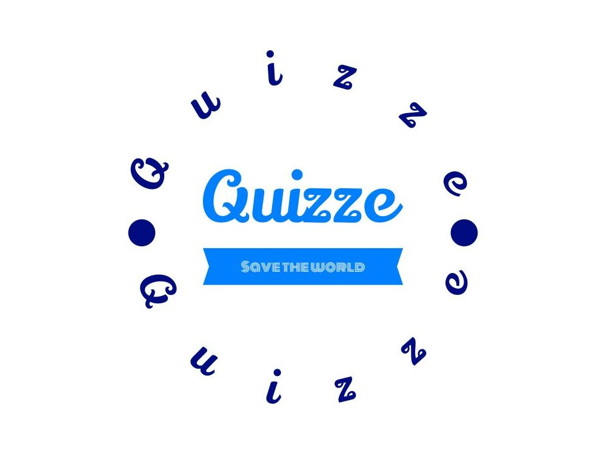

<a name="readme-top"></a>

<!--
HOW TO USE:
This is an example of how you may give instructions on setting up your project locally.

Modify this file to match your project and remove sections that don't apply.

REQUIRED SECTIONS:
- Table of Contents
- About the Project
  - Built With
  - Live Demo
- Getting Started
- Authors
- Future Features
- Contributing
- Show your support
- Acknowledgements
- License

OPTIONAL SECTIONS:
- FAQ

After you're finished please remove all the comments and instructions!
-->

<div align="center">
  <!-- You are encouraged to replace this logo with your own! Otherwise you can also remove it. -->
  
  <br/>

  <h3><b>Quizze</b></h3>

</div>

<!-- TABLE OF CONTENTS -->

# 📗 Table of Contents

- [📖 About the Project](#about-project)
  - [🛠 Built With](#built-with)
    - [Tech Stack](#tech-stack)
  - [🚀 Live Demo](#live-demo)
- [💻 Getting Started](#getting-started)
  - [Setup](#setup)
  - [Prerequisites](#prerequisites)
  - [Install](#install)
  - [Usage](#usage)
  - [Run tests](#run-tests)
  - [Deployment](#deployment)
- [👥 Authors](#authors)
- [🔭 Future Features](#future-features)
- [🤝 Contributing](#contributing)
- [⭐️ Show your support](#support)
- [🙏 Acknowledgements](#acknowledgements)
- [❓ FAQ (OPTIONAL)](#faq)
- [📝 License](#license)

<!-- PROJECT DESCRIPTION -->

# 📖 [Quizze] <a name="about-project"></a>


**[Quizze]** is an interactive quiz application designed and built using ReactJS, TypeScript, and Redux Toolkit. It features multiple-choice questions with feedback, a timer for each question, and a final score display. Users can save their score as a PNG image for sharing on social media. The application utilizes TailwindCSS for styling and is implemented in TypeScript for type safety.
..

## 🛠 Built With <a name="built-with"></a>

### Tech Stack <a name="tech-stack"></a>


<details>
  <summary>Client</summary>
  <ul>
    <li><a href="https://reactjs.org/">React.js</a></li>
    <li><a href="https://redux-toolkit.js.org/">Redux ToolKit</a></li>
    <li><a href="https://www.typescriptlang.org/">Typescript</a></li>
    <li><a href="https://tailwindcss.com/">TailwindCss</a></li>
  </ul>
</details>

<!-- Features -->


<!-- LIVE DEMO -->

## 🚀 Live Demo <a name="live-demo"></a>


- [Live Demo Link](https://quiz-for-you.vercel.app/)

<p align="right">(<a href="#readme-top">back to top</a>)</p>

<!-- GETTING STARTED -->

## 💻 Getting Started <a name="getting-started"></a>


To get a local copy up and running, follow these steps.

### Prerequisites

In order to run this project you need:

The following basics:


- a code editor eg. [vscode](https://code.visualstudio.com/download)
- node install eg. [node] (https://nodejs.org/en/download)
- npm install


<!--
Example command:

```sh
 gem install rails
```
 -->

### Setup

Clone this repository to your desired folder:

<!--
Example commands:

```sh
  cd my-folder
  git clone git@github.com:myaccount/my-project.git
```
--->

```sh
  cd folder
  git clone https://github.com/heintayzar-hm/quiz-for-you.git
```

### Install

Install this project with:

<!--
Example command:

```sh
  cd my-project
  gem install
```
--->

```sh
  cd quiz-for-you
  npm install
```

### Usage

To run the project, execute the following command:

<!--
Example command:

```sh
  rails server
```
--->

```sh
  npm run dev
```

### Run tests

To run tests, run the following command:

<!--
Example command:

```sh
  bin/rails test test/models/article_test.rb
```
--->

```sh
  npm run test
```

### Deployment

You can deploy this project using: A static site like [vercel](https://vercel.com/)

<!--
Example:

```sh

```
 -->

<p align="right">(<a href="#readme-top">back to top</a>)</p>

<!-- AUTHORS -->

## 👥 Authors <a name="authors"></a>

👤 **Hein Tay Zar**

- GitHub: [@Hein Tay](https://github.com/heintayzar-hm)
- Twitter: [@Hein Tay](https://twitter.com/heintayzarhm)
- LinkedIn: [Hein Tay](https://www.linkedin.com/in/hein-tay-zar)


<p align="right">(<a href="#readme-top">back to top</a>)</p>

<!-- FUTURE FEATURES -->

## 🔭 Future Features <a name="future-features"></a>

> Describe 1 - 3 features you will add to the project.

- [ ] **[new_feature_1]**
- [ ] **[new_feature_2]**
- [ ] **[new_feature_3]**

<p align="right">(<a href="#readme-top">back to top</a>)</p>

<!-- CONTRIBUTING -->

## 🤝 Contributing <a name="contributing"></a>

Contributions, issues, and feature requests are welcome! You have to fork and send a PR first. Make sure to pass all the liners.

Feel free to check the [issues page](../../issues/).

<p align="right">(<a href="#readme-top">back to top</a>)</p>

<!-- SUPPORT -->

## ⭐️ Show your support <a name="support"></a>


If you like this project, you can give us a star.

<p align="right">(<a href="#readme-top">back to top</a>)</p>

<!-- ACKNOWLEDGEMENTS -->

## 🙏 Acknowledgments <a name="acknowledgements"></a>

I would like to thank the [rangoon.tech](http://rangoon.tech/), for giving me this opportunities.

<p align="right">(<a href="#readme-top">back to top</a>)</p>

<!-- FAQ (optional) -->

## ❓ FAQ (OPTIONAL) <a name="faq"></a>

> Add at least 2 questions new developers would ask when they decide to use your project.

- **[Question_1]**

  - [Answer_1]

- **[Question_2]**

  - [Answer_2]

<p align="right">(<a href="#readme-top">back to top</a>)</p>

<!-- LICENSE -->
Most of the photos are from : [unsplash](https://unsplash.com/). I am very thankful for free images
## 📝 License <a name="license"></a>

This project is [MIT](./LICENSE) licensed.


<p align="right">(<a href="#readme-top">back to top</a>)</p>
